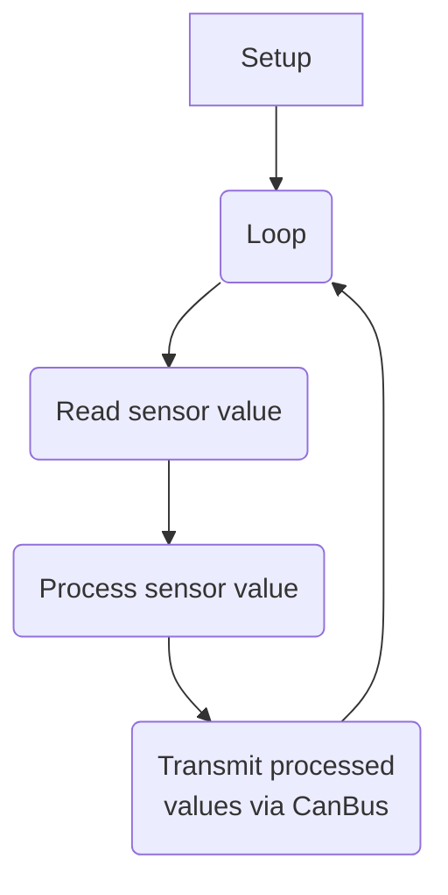
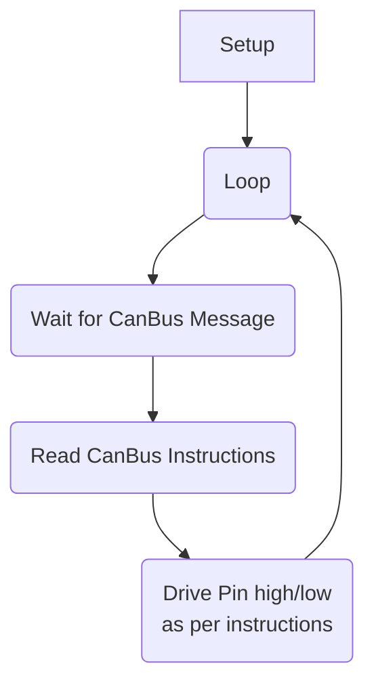

# Overview

`1 Job` is a Custom Designed PCB by [Scott CJX](https://scott-cjx.github.io) for [Nanyang Venture Formula NVF](https://nanyang-venture-formula.github.io/). Since its designer is a software person, `1 Job` is created to follow the principle of programming, having only `1 Job`.

As this PCB is designed to have `1 Job`, you may then wonder what is that `1 Job`. Well it is meant to be one of many nodes in a CanBus network. Its job is to act as either an [Input](#input) or [Output](#output) node. More will be explained.

#### You might want to see:

- [Brain](https://scott-cjx.github.io/brain) - `1 Job's` partner-in-crime
- [NVF-Data Acquisition](https://nanyang-venture-formula.github.io/) - how `1 Job` and `Brain` would work together to form a comprehensive Car EE System.

## Input

An Input node is one that will take in a user input or sensor interface and transmit its reading to the CanBus network. Some sensors that `1 Job` interfaces with include:

- (Analog) Potentiometer
- (Digital) Push Button/ Switch

The standard program flow of an Input node will be as follows:

## Output

An Output node is one that will poll the CanBus network for instructions, pulling a pin high/low as per required. Furthermore, `1 Job` will be equipped with a Solid State Relay, allowing it to connect/ disconnect a circuit much like a programmable switch, but without the need of connecting the circuits together. 

The standard program flow of an Output node will be as follows:

1. Poll for instructions from `brain` nodes
2. Pull pin high/low as per instructed

